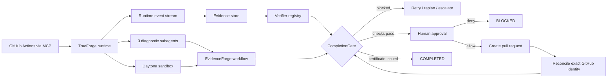

# EvidenceForge

**Agents shouldn't grade their own homework.**

EvidenceForge is an evidence-gated CI incident resolution agent built on TrueForge. It investigates failed GitHub Actions runs, reproduces failures in an isolated Daytona sandbox, generates and verifies a patch, pauses before external writes, and refuses to mark a task complete until required evidence exists.

> **Verified repository baseline — 2026-08-27:** SHA `29290cbf6b9511eaa7860d581c243fbdbfb19231` passed GitHub Actions runs [`33097953798`](https://github.com/cmdr-chara/evidenceforge/actions/runs/33097953798) and [`33097959561`](https://github.com/cmdr-chara/evidenceforge/actions/runs/33097959561). The newer fail-closed runtime candidate passes all local gates with **201/201 tests**; it is not called the final branch SHA until exact-head CI and review exist.

A credentialed TrueForge/model session and a real read-only GitHub MCP `get_commit` call were also observed (session `01m11zp6dfp08dq520eqsp9cdx`, turn `01m11zp6dyt1xq08qwdkzdns1h.local`) against the exact repository SHA. Daytona connectivity and command execution were observed separately. These observations do **not** prove the still-open end-to-end failing-revision reproduction, approval, PR creation, or completion flow.

PR #2 remains open against `determination` and is intentionally unmerged.

## Why this is not another chat wrapper

The interface is an incident console, not a chat transcript. It exposes:

- a versioned success contract;
- exactly three diagnostic specialists;
- a hypothesis ledger with supported and refuted claims;
- evidence provenance tied to runtime events and current task/patch subject;
- deterministic verifiers whose failures override reviewer confidence;
- a visible human checkpoint before GitHub pull-request creation;
- exact pull-request reconciliation before completion;
- persisted replay policy and intent → effect → settlement program counters;
- restart-safe streamed tool-call correlation and sequence cursors;
- round-level progress evaluation and a supervisor stop guard;
- no-progress fingerprints that route reconsider → replan → escalate;
- collision-safe serialized persistence;
- an application-issued, deep-immutable completion certificate with canonical payload and subject digests.

The model may say “fixed.” That statement never sets `COMPLETED`. Only `CompletionGate` can issue the certificate accepted by the state machine.

## TrueForge vs EvidenceForge

| TrueForge | EvidenceForge |
|---|---|
| agent execution loop | incident workflow and state machine |
| model-provider integration | success-contract semantics |
| MCP connectivity | bounded incident tools and risk policy |
| Daytona sandbox | reproduction and verification policy |
| dynamic subagents | exactly-three diagnostic topology |
| persistent sessions | durable domain state, streamed-event recovery, and cursor |
| human approvals | patch-bound approval provenance and serialization |
| context management | bounded model views over authoritative evidence |
| streamed runtime events | evidence provenance, terminal cutoff, and live console |

### Specialist isolation limitation

TrueForge SDK `0.1.3` was inspected directly. Its dynamic-subagent configuration exposes enablement but **does not expose a per-dynamic-subagent pre-execution tool allowlist/interceptor**. EvidenceForge therefore does not claim that the diagnostic read-only boundary is enforceable before execution with the current SDK. The runtime contract detects violations and mutation remains serialized, but Qodo's pre-execution isolation finding is recorded as **BLOCKED by the SDK surface**, not resolved. No second orchestration framework is introduced.

## Architecture



Detailed design: [docs/ARCHITECTURE.md](docs/ARCHITECTURE.md).

## Repository layout

```text
apps/server              Node HTTP API, task-scoped SSE, live TrueForge entrypoint
apps/web/public          Incident console
packages/domain          Schemas, validation, task/session models
packages/evidence        Runtime-event provenance and admissibility
packages/verification    Verifier engine, subject binding, CompletionGate
packages/policies        Risk, approval, untrusted-content, external action safety
packages/workflow        State machine, success contracts, recovery, hypotheses
packages/trueforge       Agent spec, SDK adapter, streamed recovery/runtime
packages/specialists     Three diagnostic definitions and isolated reviewer
packages/tools           Bounded contracts, replay metadata, exact mutation
packages/persistence     Durable collision-safe checkpoints and session stores
packages/telemetry       Append-only runtime event journal
skills                    Four TrueForge SKILL.md procedure packs
tests                     Unit, integration, scenario, and failure-injection tests
evals                     15-case same-input baseline comparison
demo/incident-fixture    Healthy/resettable configuration-order regression fixture
```

## Quickstart

Requirements:

- Node.js `>=22.14.0`
- pnpm `11.16.0`

```bash
corepack enable
pnpm install --frozen-lockfile
pnpm format:check
pnpm lint
pnpm typecheck
pnpm test
pnpm eval:smoke
pnpm demo:fixture
pnpm build
pnpm doctor
pnpm dev
```

Open `http://127.0.0.1:4173`.

The console starts in **deterministic fixture mode** so the control-plane behavior is reviewable without external credentials. Fixture output is never presented as live TrueForge/GitHub MCP/Daytona evidence.

## Live TrueForge mode

Copy `.env.example`, then configure a running TrueForge instance with:

1. a supported model provider;
2. the shipped `github` MCP connector;
3. a Daytona sandbox provider;
4. the four skills in `skills/`;
5. credentials held by TrueForge, not copied into the sandbox.

```bash
export TRUEFORGE_BASE_URL=http://localhost:8790
export TRUEFORGE_MODEL=openai/gpt-5.2
export TRUEFORGE_GITHUB_MCP_NAME=github
export EVIDENCEFORGE_DATA_DIR=.data
pnpm doctor
pnpm smoke:trueforge
```

`.evidenceforge/` remains ignored and preserved for legacy/local runtime state. It is not migrated or committed. New live persistence follows `EVIDENCEFORGE_DATA_DIR`, with `.data` as the configured/default location.

See [docs/TRUEFORGE_SETUP.md](docs/TRUEFORGE_SETUP.md) and [docs/DEMO.md](docs/DEMO.md).

## Completion invariants

Tests and current CI prove that:

- no model/tool/log/reviewer can directly set `COMPLETED`;
- only a genuine `CompletionGate` certificate can complete the state machine;
- the certificate is bound to task, repository, revision, patch digest, state version, success-contract digest, state digest, and subject digest;
- the issued payload is canonically digested and deeply immutable;
- nested certificate tampering is rejected;
- every required criterion needs current admissible evidence and a correlated verifier result;
- changing the patch preserves incident/root-cause evidence but invalidates patch verification, review, external approvals/actions, and related operations;
- exact PR reconciliation checks repository, base, head, head SHA, operation identity, and idempotency identity;
- the GitHub MCP adapter sends only official tool fields; a create response is only a receipt, and a later authoritative PR read is required for reconciliation;
- same SHA on a different PR target is rejected;
- concurrent approval decisions are serialized to one submission path;
- completed-turn resume advances to the maximum observed sequence and skips persisted history;
- restart between streamed tool-call construction and `tool.response` preserves correlation;
- terminal state creates a durable cutoff after which late events cannot mutate/persist actionable state;
- persistence isolates colliding task IDs such as `a/b` and `a_b`, serializes writes, and retains legacy read fallback.

## Evaluation

The deterministic 15-case comparison applies the same scenario inputs to an unenforced baseline and EvidenceForge. The report remains fixture/control-policy evidence, not general model-performance evidence. Recovery success now uses the same definition for both systems and requires a real `COMPLETED` terminal; `BLOCKED` and `ESCALATED` never count as recovery success.

See [docs/EVALUATION.md](docs/EVALUATION.md).

## UI/accessibility status

The console includes task-scoped SSE with snapshot reload on reconnect, defense-in-depth task filtering, explicit INFO/SUCCESS/WARNING/ERROR/BLOCKED activity states, >=44px primary controls, visible focus, skip link, accessible live/log regions, long-value titles/ARIA labels, reduced-motion handling, and responsive rules down to 320px-class layouts.

The exact 320 / 375 / 768 / 1024 / 1440 px widths were browser-observed without page-level horizontal overflow. Exact browser 200% zoom remains manual; a 640px equivalent reflow is not represented as exact zoom evidence.

## Security

Repository content, issue text, logs, and tool output are treated as untrusted data. External writes use `PREPARE → APPROVE → COMMIT → RECONCILE`. Privileged and destructive operations are denied by the P0 policy. Repository code is intended to execute only inside Daytona in live mode.

See [docs/SECURITY.md](docs/SECURITY.md).

## Qodo Code Review Evidence

Qodo Agentic Review is genuinely present on PR #2.

- PR: https://github.com/cmdr-chara/evidenceforge/pull/2
- Initial/aggregate Qodo review: https://github.com/cmdr-chara/evidenceforge/pull/2#issuecomment-5417017502
- Earlier follow-up request: https://github.com/cmdr-chara/evidenceforge/pull/2#issuecomment-5428521720
- Final exact-SHA request: https://github.com/cmdr-chara/evidenceforge/pull/2#issuecomment-5440874929
- Current triage: [docs/qodo-review-log.md](docs/qodo-review-log.md)

Qodo's exact review of `29290cb…` marked the preceding cursor/path findings resolved and exposed three deeper runtime transaction findings. The current candidate bounds generation drain, marks uncertain approval effects before fail-closed persistence, and journals before admitting events; all three have deterministic regressions and await exact-head Qodo confirmation. The **read-only dynamic-subagent pre-execution boundary remains BLOCKED by TrueForge SDK 0.1.3**.

## Hackathon documentation

- [Current requirements](docs/hackathon-requirements.md)
- [Architecture](docs/ARCHITECTURE.md)
- [Security](docs/SECURITY.md)
- [Evaluation](docs/EVALUATION.md)
- [Demo script](docs/DEMO.md)
- [Build journal](docs/build-journal.md)
- [Field report draft](docs/FIELD_REPORT_DRAFT.md)
- [Submission checklist](docs/SUBMISSION_CHECKLIST.md)
- [Completion ledger](docs/GATES.autonomous-build.md)

## AI-assistance disclosure

This repository was developed with AI coding assistance. Test output, external service behavior, Qodo reviews, GitHub Actions status, sponsor integration results, and evaluation metrics are reported only when actually observed.

## License

MIT. See [LICENSE](LICENSE).
