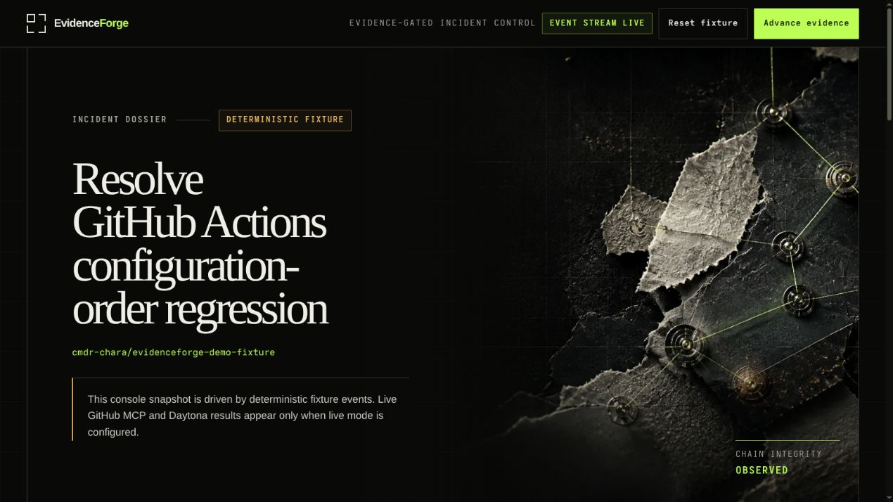
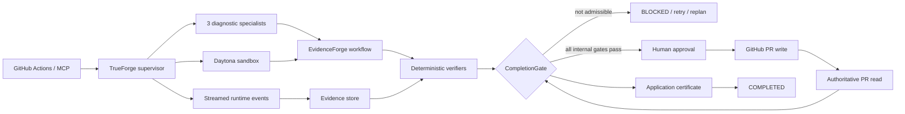

# EvidenceForge

**Agents shouldn't grade their own homework.**

EvidenceForge is an evidence-gated CI incident control plane built on TrueForge. It binds a failed GitHub Actions incident to an exact repository revision, reproduces it in Daytona, captures and verifies a patch, obtains an independent patch review, pauses before any external write, reconciles the resulting pull request, and permits completion only through an application-issued certificate.

> **Release status — 2026-08-29:** the substantive implementation was human-reviewed and squash-merged through [PR #2](https://github.com/cmdr-chara/evidenceforge/pull/2) into `determination` at [`819c281`](https://github.com/cmdr-chara/evidenceforge/commit/819c2815b5bd8cfdf35847ed76a58a457168e74c). [PR #4](https://github.com/cmdr-chara/evidenceforge/pull/4) is the single submission-readiness PR and consolidates the later diagnostic hardening, live proof, documentation, and media updates. Its exact-head CI and Qodo results are authoritative. Human merge remains a release gate.

## Demo video

**[Watch the 2:50 EvidenceForge demo](https://streamable.com/5sbk1k).**

The video keeps the evidence boundary visible: the deterministic baseline is labeled separately from the credentialed TrueForge workflow, which reaches **10/10** only after human approval, an observed GitHub PR write, authoritative reconciliation, and an application-issued CompletionGate certificate. This is the product's ten-criterion contract, not a hackathon score.



## Evidence boundary

EvidenceForge deliberately separates three kinds of evidence:

| Evidence | Observed result | What it proves |
|---|---|---|
| Repository verification | frozen install, format, lint, typecheck, 247 tests, evaluation, fixture, build, doctor, diff check | the consolidated candidate passes locally; exact-head publication results are recorded on PR #4 |
| Credentialed live TrueForge workflow | 10/10 application gates and a CompletionGate certificate | real TrueForge, GitHub MCP, Daytona, three specialists, deterministic verification, independent review, human approval, PR creation, and reconciliation worked together |
| Deterministic fixture | complete approval, reconciliation, and CompletionGate certificate path | control-plane semantics, not live sponsor integration |

Earlier credentialed attempts correctly blocked an invalid PR target and a specialist budget violation. The final live run passed the nine internal criteria, paused for a human decision, created [PR #9](https://github.com/cmdr-chara/evidenceforge/pull/9), reconciled its exact external identity, passed `external-pr`, and received an application-issued certificate. PR #9 remains open and unmerged; completion certifies the configured workflow contract, not repository merge or hackathon judging.

## Core invariant

No model, repository file, issue, log, tool response, or reviewer may directly set `COMPLETED`.

Only `CompletionGate` may issue the certificate accepted by the state machine, and only after every required criterion has current, admissible evidence bound to the exact task, repository, revision, patch digest, state version, success contract, reviewer result, and reconciled external identity.

## Why this is not a chat wrapper

The console exposes application state and evidence rather than a model transcript:

- a versioned success contract;
- exactly three named diagnostic specialists in one read-only fan-out;
- a bounded structured causal-output contract for each specialist;
- a hypothesis ledger whose specialist claims begin as non-authoritative `OPEN` observations;
- application-owned promotion to `SUPPORTED` only after exact incident, reproduction, and causal evidence correlate;
- Daytona-only repository execution in live mode;
- application-owned bootstrap, patch-capture, and verifier manifests;
- patch-digest-bound independent review;
- durable streamed-event journaling and checkpoint recovery;
- patch-bound, expiring, one-time approval provenance;
- intent → effect → settlement records for external operations;
- exact pull-request reconciliation;
- a deeply immutable, canonically digested completion certificate.

## Sponsor integrations

| Integration | EvidenceForge usage |
|---|---|
| TrueForge | Primary supervisor runtime, persistent sessions, streamed events, three dynamic diagnostic specialists, skills, continuation, and approval pauses |
| Daytona | Isolated checkout, bootstrap, failure reproduction, patching, and verifier execution for credentialed live workflows |
| GitHub MCP | Exact commit lookup, approval-gated pull-request creation, and authoritative pull-request reconciliation |
| Qodo | Agentic review on the substantive PR and exact-head submission-readiness follow-up; the final aggregate reports 0 bugs and 0 rule violations |

## Architecture



Detailed design: [docs/ARCHITECTURE.md](docs/ARCHITECTURE.md).

## Repository layout

```text
apps/server              HTTP API, live workflow, GitHub MCP validation, task-scoped SSE
apps/web/public          EvidenceForge incident console
packages/domain          strict domain types, validation, canonical state
packages/evidence        evidence provenance and admissibility
packages/verification    deterministic verifiers and CompletionGate
packages/policies        untrusted-content, risk, approval, external-action policy
packages/workflow        state machine, success contracts, recovery and hypotheses
packages/trueforge       agent spec, streamed runtime, continuation and recovery
packages/specialists     three diagnostics plus independent patch reviewer
packages/persistence     durable collision-safe session/checkpoint stores
packages/telemetry       append-only runtime event journal
skills                    four TrueForge procedure packs
tests                     unit, integration, scenario and failure-injection tests
evals                     deterministic EvidenceForge vs unenforced-baseline corpus
demo/incident-fixture    resettable deterministic demonstration fixture
```

## Quickstart

Requirements:

- Node.js `22.14.0` or newer compatible 22.x runtime;
- pnpm `11.16.0`.

```bash
corepack enable
pnpm install --frozen-lockfile
pnpm format:check
pnpm lint
pnpm typecheck
pnpm test
pnpm eval:smoke
pnpm demo:fixture
pnpm build
pnpm doctor
pnpm dev
```

Open `http://127.0.0.1:4173`. The default console is explicitly labeled **Deterministic fixture**. Fixture output must never be represented as credentialed TrueForge, GitHub MCP, or Daytona evidence.

### Judge demo in 60 seconds

After installation, reset and validate the deterministic fixture before opening the console:

```bash
pnpm demo:reset
pnpm demo:fixture
pnpm dev
```

Then open `http://127.0.0.1:4173` and use **Advance evidence** to inspect the application-owned gate transitions. The fixture demonstrates control-plane semantics; follow [docs/TRUEFORGE_SETUP.md](docs/TRUEFORGE_SETUP.md) for the credentialed sponsor-integrated workflow.

## Live TrueForge profile

The profiled incident is deliberately exact:

- repository: `cmdr-chara/evidenceforge`;
- GitHub Actions run: `32892119950`;
- failing revision: `9accc9e484e055c8b22172e389dc50f84315f4e2`;
- baseline command: `pnpm test:unit`;
- expected failure: `authoritative TrueForge sandbox non-zero exit is never reported as OK`.

The historical revision has no committed lockfile. Its live bootstrap therefore uses `pnpm install --no-frozen-lockfile` while pinning Node `22.14.0` and pnpm `11.16.0`. Normal repository CI remains frozen.

The supervisor preloads only `get_commit`, `create_pull_request`, and `pull_request_read` from the GitHub MCP server. The profiled demo PR write remains approval-paused and targets the preserved reviewed demo head `feat/foundation-control-plane` against `determination`. See [docs/TRUEFORGE_SETUP.md](docs/TRUEFORGE_SETUP.md).

### SDK limitation

TrueForge SDK `0.1.3` does not expose a per-dynamic-subagent pre-execution tool interceptor or allowlist. The supervisor MCP surface is restricted, tool budgets are enforced, and any specialist contract violation fails closed; however, post-event rejection is not represented as equivalent to pre-execution prevention. That boundary remains **BLOCKED by the SDK surface**, not falsely marked fixed.

## Evaluation

The deterministic 15-case corpus uses the same scenario inputs for EvidenceForge and an unenforced baseline. EvidenceForge measured **0% false success**, versus **57.14%** for the baseline. These are control-policy results, not general model-quality claims. See [docs/EVALUATION.md](docs/EVALUATION.md).

## UI and accessibility

The console provides task-scoped SSE, snapshot reconstruction, semantic INFO/SUCCESS/WARNING/ERROR/BLOCKED states, accessible log/live regions, visible focus, a skip link, reduced-motion behavior, >=44px primary targets, bounded activity regions, and long-value wrapping.

The 320, 375, 768, 1024, and 1440px layouts were browser-observed without page-level horizontal overflow. The subsequent executable changes do not alter layout geometry; the final accessibility pass improves small muted-text contrast and locks it with a deterministic WCAG contrast test. Exact 200% browser zoom remains a manual release check and is not inferred from equivalent viewport width.

## Qodo Code Review Evidence

Qodo Agentic Review reviewed the substantive implementation on [merged PR #2](https://github.com/cmdr-chara/evidenceforge/pull/2). The canonical aggregate is [this review comment](https://github.com/cmdr-chara/evidenceforge/pull/2#issuecomment-5417017502); detailed disposition is in [docs/qodo-review-log.md](docs/qodo-review-log.md).

Qodo findings directly drove fixes for certificate immutability, stale approvals, PR reconciliation, recovery races, fabricated root cause, unresolved or prefix-matched references, nested failed results, and non-zero command results. Exact context plus exact reproduction alone leaves `root-cause-supported` pending. Every specialist reference must resolve to a successful earlier result from the same thread, and any enclosing `success: false`, failure status, or non-zero `exitCode`/`exit_code` makes that result inadmissible.

The remaining **Read-only boundary is unenforced** High is valid but cannot be implemented against TrueForge SDK `0.1.3`: the SDK exposes no per-dynamic-subagent pre-execution allowlist or interceptor. EvidenceForge restricts the supervisor, enforces budgets and fails closed after violations, but does not falsely claim that post-event detection prevents execution. The exact follow-up Qodo request and disposition are recorded on the submission-readiness PR because a repository document cannot contain the SHA of the commit that contains itself.

The substantive release flow was:

```text
issue → feat/foundation-control-plane → PR #2 → Qodo → human Squash and merge → determination
```

## Submission status

The substantive implementation is merged; the credentialed live 10/10 path, exact 200% zoom check, and public demo are recorded. Remaining gates are explicitly tracked in [docs/SUBMISSION_CHECKLIST.md](docs/SUBMISSION_CHECKLIST.md): exact-head CI and Qodo on consolidated PR #4, human merge, and official hackathon submission.

## AI-assistance disclosure

This repository was developed with AI coding assistance. CI, Qodo, TrueForge, Daytona, GitHub MCP, fixture, evaluation, and live-integration evidence are reported only when actually observed.

## License

MIT. See [LICENSE](LICENSE).
