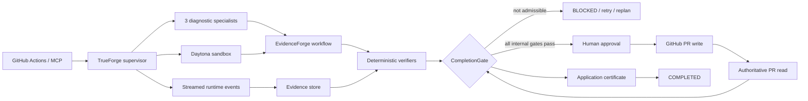

# EvidenceForge

**Agents shouldn't grade their own homework.**

EvidenceForge is an evidence-gated CI incident control plane built on TrueForge. It binds a failed GitHub Actions incident to an exact repository revision, reproduces it in Daytona, captures and verifies a patch, obtains an independent patch review, pauses before any external write, reconciles the resulting pull request, and permits completion only through an application-issued certificate.

> **Release status — 2026-08-28:** [PR #2](https://github.com/cmdr-chara/evidenceforge/pull/2) is the authoritative record for the exact final SHA, exact-head GitHub Actions run, Qodo status, and remaining human actions. The executable candidate passes the frozen local matrix with **231/231 tests**; exact-head CI is recorded externally after publication. The PR remains open and unmerged, with `feat/foundation-control-plane` targeting `determination`.

## Evidence boundary

EvidenceForge deliberately separates three kinds of evidence:

| Evidence | Observed result | What it proves |
|---|---|---|
| Repository verification | frozen install, format, lint, typecheck, 231 tests, evaluation, fixture, build, doctor, diff check | the executable candidate is reproducible and internally consistent; exact-head CI remains an external publication gate |
| Credentialed live TrueForge workflow | strongest run reached 9/10 application gates | real TrueForge, GitHub MCP, Daytona, three specialists, deterministic verification, and independent review worked together |
| Deterministic fixture | complete approval, reconciliation, and CompletionGate certificate path | control-plane semantics, not live sponsor integration |

The strongest credentialed run passed `incident-context`, `failure-reproduced`, `root-cause-supported`, `regression`, `targeted-tests`, `typecheck`, `lint`, `diff-integrity`, and `independent-review`. `external-pr` remained pending because the model proposed an invalid PR target; EvidenceForge blocked before any write. A later attempt was also blocked when one diagnostic specialist exceeded the bounded tool budget. No wrong PR was created, no external write was auto-approved, and no merge occurred.

## Core invariant

No model, repository file, issue, log, tool response, or reviewer may directly set `COMPLETED`.

Only `CompletionGate` may issue the certificate accepted by the state machine, and only after every required criterion has current, admissible evidence bound to the exact task, repository, revision, patch digest, state version, success contract, reviewer result, and reconciled external identity.

## Why this is not a chat wrapper

The console exposes application state and evidence rather than a model transcript:

- a versioned success contract;
- exactly three named diagnostic specialists in one read-only fan-out;
- a bounded structured causal-output contract for each specialist;
- a hypothesis ledger whose specialist claims begin as non-authoritative `OPEN` observations;
- application-owned promotion to `SUPPORTED` only after exact incident, reproduction, and causal evidence correlate;
- Daytona-only repository execution in live mode;
- application-owned bootstrap, patch-capture, and verifier manifests;
- patch-digest-bound independent review;
- durable streamed-event journaling and checkpoint recovery;
- patch-bound, expiring, one-time approval provenance;
- intent → effect → settlement records for external operations;
- exact pull-request reconciliation;
- a deeply immutable, canonically digested completion certificate.

## Architecture



Detailed design: [docs/ARCHITECTURE.md](docs/ARCHITECTURE.md).

## Repository layout

```text
apps/server              HTTP API, live workflow, GitHub MCP validation, task-scoped SSE
apps/web/public          EvidenceForge incident console
packages/domain          strict domain types, validation, canonical state
packages/evidence        evidence provenance and admissibility
packages/verification    deterministic verifiers and CompletionGate
packages/policies        untrusted-content, risk, approval, external-action policy
packages/workflow        state machine, success contracts, recovery and hypotheses
packages/trueforge       agent spec, streamed runtime, continuation and recovery
packages/specialists     three diagnostics plus independent patch reviewer
packages/persistence     durable collision-safe session/checkpoint stores
packages/telemetry       append-only runtime event journal
skills                    four TrueForge procedure packs
tests                     unit, integration, scenario and failure-injection tests
evals                     deterministic EvidenceForge vs unenforced-baseline corpus
demo/incident-fixture    resettable deterministic demonstration fixture
```

## Quickstart

Requirements:

- Node.js `22.14.0` or newer compatible 22.x runtime;
- pnpm `11.16.0`.

```bash
corepack enable
pnpm install --frozen-lockfile
pnpm format:check
pnpm lint
pnpm typecheck
pnpm test
pnpm eval:smoke
pnpm demo:fixture
pnpm build
pnpm doctor
pnpm dev
```

Open `http://127.0.0.1:4173`. The default console is explicitly labeled **Deterministic fixture**. Fixture output must never be represented as credentialed TrueForge, GitHub MCP, or Daytona evidence.

## Live TrueForge profile

The profiled incident is deliberately exact:

- repository: `cmdr-chara/evidenceforge`;
- GitHub Actions run: `32892119950`;
- failing revision: `9accc9e484e055c8b22172e389dc50f84315f4e2`;
- baseline command: `pnpm test:unit`;
- expected failure: `authoritative TrueForge sandbox non-zero exit is never reported as OK`.

The historical revision has no committed lockfile. Its live bootstrap therefore uses `pnpm install --no-frozen-lockfile` while pinning Node `22.14.0` and pnpm `11.16.0`. Normal repository CI remains frozen.

The supervisor preloads only `get_commit`, `create_pull_request`, and `pull_request_read` from the GitHub MCP server. The PR write remains approval-paused and must target `head: feat/foundation-control-plane`, `base: determination`. See [docs/TRUEFORGE_SETUP.md](docs/TRUEFORGE_SETUP.md).

### SDK limitation

TrueForge SDK `0.1.3` does not expose a per-dynamic-subagent pre-execution tool interceptor or allowlist. The supervisor MCP surface is restricted, tool budgets are enforced, and any specialist contract violation fails closed; however, post-event rejection is not represented as equivalent to pre-execution prevention. That boundary remains **BLOCKED by the SDK surface**, not falsely marked fixed.

## Evaluation

The deterministic 15-case corpus uses the same scenario inputs for EvidenceForge and an unenforced baseline. EvidenceForge measured **0% false success**, versus **57.14%** for the baseline. These are control-policy results, not general model-quality claims. See [docs/EVALUATION.md](docs/EVALUATION.md).

## UI and accessibility

The console provides task-scoped SSE, snapshot reconstruction, semantic INFO/SUCCESS/WARNING/ERROR/BLOCKED states, accessible log/live regions, visible focus, a skip link, reduced-motion behavior, >=44px primary targets, bounded activity regions, and long-value wrapping.

The 320, 375, 768, 1024, and 1440px layouts were browser-observed without page-level horizontal overflow. The subsequent executable changes do not alter layout geometry; the final accessibility pass improves small muted-text contrast and locks it with a deterministic WCAG contrast test. Exact 200% browser zoom remains a manual release check and is not inferred from equivalent viewport width.

## Qodo and release workflow

Qodo Agentic Review is active on PR #2. The canonical aggregate is [this review comment](https://github.com/cmdr-chara/evidenceforge/pull/2#issuecomment-5417017502); detailed disposition is in [docs/qodo-review-log.md](docs/qodo-review-log.md).

The finalization passes resolved serialized prompt expansion, the fabricated-root-cause path, and promotion of unresolved model-authored references. Exact context plus exact reproduction alone leaves `root-cause-supported` pending. Specialist causal claims are bounded and structured; every cited reference must resolve to a successful, earlier tool result from the same specialist thread. Only those event-backed observations can enter application-owned correlation.

The final post-commit exact-SHA request and status are recorded in the PR body because a repository document cannot truthfully contain the SHA of the commit that contains itself.

The required release flow remains:

```text
issue → feat/foundation-control-plane → PR #2 → Qodo → human Squash and merge
```

Suggested squash title:

```text
feat: add EvidenceForge evidence-gated incident control plane
```

## Submission status

Repository implementation and executable CI are release-ready. Remaining external/manual work is explicitly tracked in [docs/SUBMISSION_CHECKLIST.md](docs/SUBMISSION_CHECKLIST.md): exact final-head CI after this documentation commit, exact 200% zoom, a stable credentialed live `external-pr` path, public demo video, human merge, and official hackathon submission.

## AI-assistance disclosure

This repository was developed with AI coding assistance. CI, Qodo, TrueForge, Daytona, GitHub MCP, fixture, evaluation, and live-integration evidence are reported only when actually observed.

## License

MIT. See [LICENSE](LICENSE).
