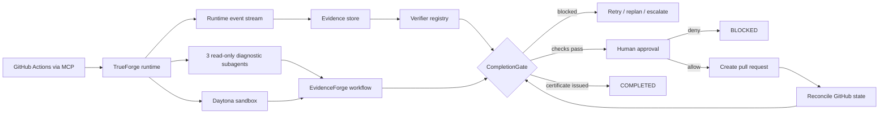

# EvidenceForge

**Agents shouldn't grade their own homework.**

EvidenceForge is an evidence-gated CI incident resolution agent built on TrueForge. It investigates failed GitHub Actions runs, reproduces failures in an isolated Daytona sandbox, generates and verifies a patch, pauses before external writes, and refuses to mark a task complete until required evidence exists.

> **Current repository status:** the deterministic EvidenceForge control plane, incident console, five-case evaluation corpus, failure-injection suite, TrueForge SDK adapter, skills, and demo fixture are implemented and locally verified. Live TrueForge, GitHub MCP, Daytona, and Qodo runs require external credentials or app installation and are deliberately reported as blocked until observed.

## Why this is not another chat wrapper

The interface is an incident console, not a chat transcript. It exposes:

- a versioned success contract;
- exactly three parallel, read-only diagnostic specialists;
- a hypothesis ledger with supported and refuted claims;
- evidence provenance tied to runtime events;
- deterministic verifiers whose failures override reviewer confidence;
- a visible human checkpoint before GitHub pull-request creation;
- external-state reconciliation before completion;
- an application-issued completion certificate.

The model may say “fixed.” That statement never sets `COMPLETED`.

## TrueForge vs EvidenceForge

| TrueForge | EvidenceForge |
|---|---|
| agent execution loop | incident workflow and state machine |
| model-provider integration | success-contract semantics |
| MCP connectivity | bounded GitHub incident tools |
| Daytona sandbox | reproduction and verification policy |
| dynamic subagents | exactly-three read-only diagnostic topology |
| persistent sessions | persisted incident-domain state and cursor |
| human approvals | risk overlay and external-action protocol |
| context management | evidence summaries and artifact retrieval policy |
| streamed runtime events | evidence provenance and incident console |

## Architecture



Detailed design: [docs/ARCHITECTURE.md](docs/ARCHITECTURE.md).

## Repository layout

```text
apps/server              Node HTTP API, SSE stream, live TrueForge entrypoint
apps/web/public          Incident console
packages/domain          Schemas, validation, task/session models
packages/evidence        Runtime-event provenance and admissibility
packages/verification    Verifier engine and CompletionGate
packages/policies        Risk, approval, prompt-injection, external action safety
packages/workflow        State machine, success contracts, recovery, hypotheses
packages/trueforge       Agent spec, SDK adapter, reconnect/resume runtime
packages/specialists     Three diagnostic definitions and isolated reviewer
packages/tools           Narrow bounded tool contracts
packages/persistence     Durable JSON session state
packages/telemetry       Append-only runtime event journal
skills                    Four TrueForge SKILL.md procedure packs
tests                     Unit, integration, scenario, and failure-injection tests
evals                     Five-case false-success evaluation
demo/incident-fixture    Healthy/resettable configuration-order regression fixture
```

## Quickstart

Requirements:

- Node.js `>=22.14.0`
- pnpm `11.16.0`

```bash
corepack enable
pnpm install --no-frozen-lockfile
pnpm lint
pnpm typecheck
pnpm test
pnpm eval:smoke
pnpm demo:fixture
pnpm dev
```

Open `http://127.0.0.1:4173`.

The console starts in **deterministic fixture mode** so the control-plane behavior is reviewable without external credentials. Use **Advance evidence**, approve or reject the exact PR action, and inspect the resulting certificate or blocked state.

## Live TrueForge mode

Copy `.env.example`, then configure a running TrueForge instance with:

1. a supported model provider;
2. the shipped `github` MCP connector;
3. a Daytona sandbox provider;
4. the four skills in `skills/`;
5. credentials held by TrueForge, not copied into the sandbox.

```bash
export TRUEFORGE_BASE_URL=http://localhost:8790
export TRUEFORGE_MODEL=openai/gpt-5.2
export TRUEFORGE_GITHUB_MCP_NAME=github
pnpm doctor
pnpm smoke:trueforge
```

The live incident form creates an inline TrueForge agent spec with sandboxing, dynamic subagents, compaction, large-result offloading, four skills, and GitHub write approvals enabled. Session, turn, and sequence IDs are persisted for reconnect/resume.

See [docs/TRUEFORGE_SETUP.md](docs/TRUEFORGE_SETUP.md) and [docs/DEMO.md](docs/DEMO.md).

## Completion invariants

`CompletionGate` is located at `packages/verification/src/completion-gate.ts`. Tests prove that:

- the model cannot directly set `COMPLETED`;
- every required criterion must be `PASS`;
- every PASS needs admissible evidence tied to a registered runtime event;
- free-form model prose is not verification evidence;
- a deterministic FAIL overrides reviewer PASS;
- a fabricated certificate cannot complete the state machine;
- external writes require approval and reconciliation;
- failed verification can end in `BLOCKED` or `ESCALATED`.

## Evaluation

The current local evaluation contains five deterministic cases, including misleading evidence and one intentionally unresolved case. The latest measured run is documented in [docs/EVALUATION.md](docs/EVALUATION.md). It reported zero false-success completions; the unresolved case escalated instead of being marked complete.

These are fixture results, not claims about live sponsor infrastructure or general production performance.

## Security

Repository content, issue text, logs, and tool output are treated as untrusted data. External writes use `PREPARE → APPROVE → COMMIT → RECONCILE`. Privileged and destructive operations are denied by the P0 policy. Repository code is intended to execute only inside Daytona in live mode.

See [docs/SECURITY.md](docs/SECURITY.md).

## Qodo Code Review Evidence

Qodo evidence cannot be manufactured. The first meaningful PR will be linked here after a real Qodo `/agentic_review`, triage of all valid High findings, any corrective commits, and a follow-up review.

- Representative PR: **pending live Qodo installation/review**
- Initial findings: **none recorded yet**
- Follow-up evidence: **none recorded yet**
- Review log: [docs/qodo-review-log.md](docs/qodo-review-log.md)

## Hackathon documentation

- [Current requirements](docs/hackathon-requirements.md)
- [Architecture](docs/ARCHITECTURE.md)
- [Security](docs/SECURITY.md)
- [Evaluation](docs/EVALUATION.md)
- [Demo script](docs/DEMO.md)
- [Build journal](docs/build-journal.md)
- [Field report draft](docs/FIELD_REPORT_DRAFT.md)
- [Submission checklist](docs/SUBMISSION_CHECKLIST.md)
- [Completion ledger](docs/GATES.autonomous-build.md)

## AI-assistance disclosure

This repository was developed with AI coding assistance. Test output, external service behavior, Qodo reviews, GitHub Actions status, sponsor integration results, and evaluation metrics are reported only when actually observed.

## License

MIT. See [LICENSE](LICENSE).
