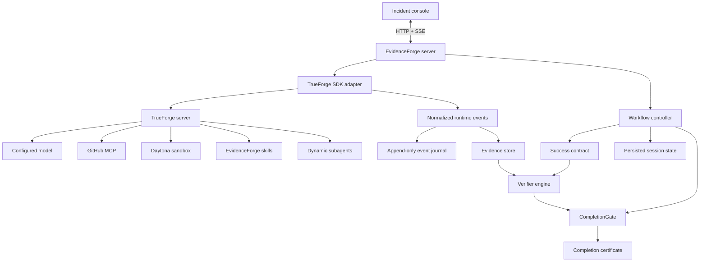
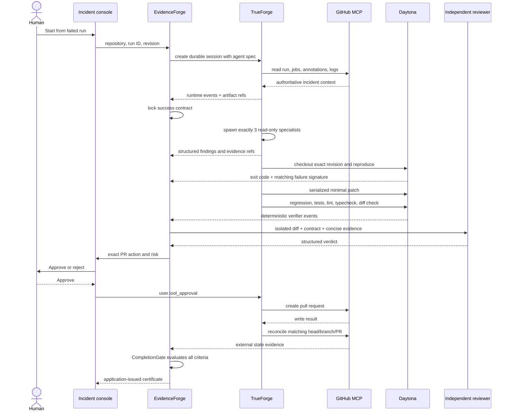
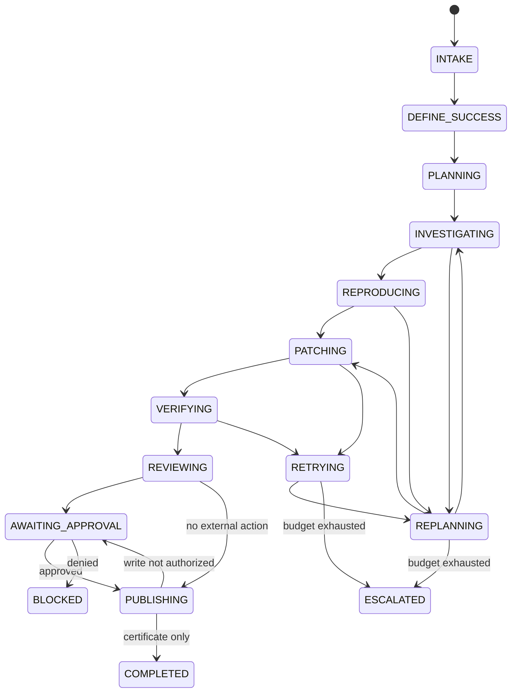
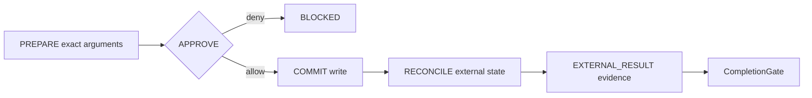

# EvidenceForge architecture

## 1. Purpose

EvidenceForge resolves CI incidents while separating two responsibilities that many agents conflate:

1. **performing work**, which may involve an LLM;
2. **proving completion**, which is controlled by deterministic application logic.

TrueForge is the agent harness. EvidenceForge is the incident-domain control layer.

## 2. Terminology

- **Success contract:** versioned required criteria and their verifiers.
- **Runtime event:** an observed TrueForge/tool/sandbox event with a stable ID.
- **Evidence:** a claim tied to a registered runtime event and artifact references.
- **Verifier:** a deterministic or explicitly typed oracle that evaluates one criterion.
- **CompletionGate:** the only component that may issue a completion certificate.
- **Reconciliation:** reading the external system after a consequential write to confirm actual state.
- **False success:** a task marked complete while an independent oracle says it remains incomplete.

## 3. Runtime boundary

| TrueForge owns | EvidenceForge owns |
|---|---|
| model calls and agent loop | incident state machine |
| MCP connectivity and discovery | semantic, bounded tool contracts |
| Daytona sandbox lifecycle | reproduction and verification policy |
| dynamic subagent execution | exactly-three diagnostic topology |
| persistent harness sessions | domain state and evidence references |
| approvals and pause/resume | trusted risk classification |
| context compaction and offloading | incident-specific context selection |
| streamed events | provenance, UI, and completion logic |

No second generic orchestration runtime is introduced.

## 4. System diagram



## 5. Incident sequence



## 6. State machine



`SessionController.transition()` rejects direct transition to `COMPLETED`. `completeWithCertificate()` accepts only an object issued by `CompletionGate` for the same task.

## 7. Evidence model

| Kind | Meaning | Typical source |
|---|---|---|
| `OBSERVATION` | authoritative fact returned by a tool | GitHub MCP run/job read |
| `REPRODUCTION` | failure independently recreated | Daytona command event |
| `VERIFICATION` | predefined check passed or failed | regression/test/lint/typecheck event |
| `REVIEW` | independent assessment | isolated reviewer result |
| `EXTERNAL_RESULT` | external side effect confirmed | GitHub reconciliation read |

Evidence is admissible only when:

1. its `sourceEventId` exists in the runtime-event store;
2. the source event is not free-form model prose;
3. the evidence kind matches the criterion's verifier;
4. the evidence outcome is `PASS`;
5. the source tool is not a model-only pseudo-source.

## 8. Success contract

The CI contract is created before patching. It includes authoritative context, failure reproduction, supported root cause, regression verification, relevant tests, typecheck, lint, diff integrity, independent review, and external PR reconciliation.

Contracts are repository-aware. Inapplicable checks should be omitted when the contract is created, not silently removed after failure.

## 9. CompletionGate

The gate rejects completion when any of these conditions holds:

- a required criterion is `PENDING`, `FAIL`, or `INCONCLUSIVE`;
- a required PASS lacks admissible evidence;
- any deterministic verifier recorded a FAIL for that criterion;
- the original failure was not reproduced;
- the patch digest is missing;
- the reviewer verdict is `BLOCK` or absent;
- a prepared external action is not reconciled.
- no current round-level evaluation makes completion admissible;
- an effect is still `EFFECT_STARTED` or `EFFECT_UNCERTAIN` without durable settlement.

A reviewer PASS cannot override the latest deterministic failure. A valid certificate is generated only inside the gate and is tracked by a module-private issuance registry. `StopGuard` evaluates the current round before any natural successful stop and routes incomplete work to verification, replan, blocking, or escalation.

## 10. Subagent design

Exactly three diagnostic specialists run during `INVESTIGATING`:

1. Repository Investigator
2. Failure / Log Investigator
3. Dependency / Configuration Investigator

Their contexts are isolated, but TrueForge documents that subagents share the same tools and sandbox. Therefore their capabilities explicitly forbid file writes, patching, installation, commits, and external writes. The main thread aggregates their structured results. Reproduction and patching then run serially.

The reviewer runs later with fresh context and receives the task, final diff, concise evidence, verifier results, contract, and constraints—but not the patching transcript.

## 11. Tool architecture

Routine information access uses narrow contracts:

```ts
search_logs({ artifactRef, query, maxMatches: 20, contextLines: 3 })
search_repository({ query, paths, maxResults: 20 })
get_incident_context({ repository, runId })
```

Raw shell is confined to the sandbox and uses explicit argv, cwd, timeout, network policy, and output bounds. `sudo` is rejected. Structured text edits use exact single-match targets, reject overlap and stale base digests, serialize writes to the same file, and emit before/after and patch SHA-256 metadata. Shell access remains available because real repository work cannot be reduced to structured edits alone.

## 12. Context strategy

The supervisor retains:

- objective and constraints;
- current phase and plan;
- success contract;
- active and refuted hypotheses;
- concise evidence summaries;
- changed-file summary;
- verifier status;
- blockers and retry budget.

Large logs, repository files, and command output become artifacts. TrueForge compaction and large-response offloading are enabled. The authoritative `EvidenceStore` retains complete event-correlated facts and artifact references; `modelFacingView` creates a bounded, lossy projection without mutating that store. No vector database is introduced.

## 13. Persistence and reconnect

EvidenceForge persists:

- domain task and phase;
- contract, plan, hypotheses, approvals, verifier results;
- evidence IDs;
- patch/replan/retry counters;
- TrueForge session ID;
- active turn ID;
- last SSE sequence number;
- final certificate.
- operation journal with exact arguments, replay policy, effect program counter, and settlement;
- round evaluations and no-progress attempt fingerprints.

Reconnect uses `getTurn`. A running turn resumes through `subscribeToTurn(afterSequenceNumber)`; a completed turn can be rebuilt from `listTurnEvents`.

## 14. Failure recovery

| Class | Behavior |
|---|---|
| transient | exponential backoff with bounded deterministic jitter; two retries |
| input error | correct structured input; do not repeat unchanged |
| semantic failure | replan because the hypothesis or patch is wrong |
| policy denied | safe alternative or `BLOCKED` |
| environment failure | recreate exact revision and restore known patch artifact |
| budget exhausted | `ESCALATED` |
| repeated no progress | fingerprint tool, normalized arguments, revision/state, and result; reconsider, replan, then escalate |

Every consequential operation uses an explicit durable program counter:

```text
INTENT_DURABLE → EFFECT_STARTED → SETTLED
                              ↘ EFFECT_UNCERTAIN
```

The intent records exact normalized arguments and digest, repository/revision, risk, replay policy, expected evidence, and any idempotency key. Settlement records the authoritative result, runtime event, evidence IDs, next workflow phase, and time. Recovery may replay `SAFE`, must inspect authoritative state for `RECONCILE_FIRST`, and blocks automatic repetition for `NEVER`. This is not a claim of exactly-once delivery; it makes uncertainty explicit where external systems cannot provide it.

## 15. External-action protocol



The idempotency key is `SHA-256(sessionId + ":" + patchDigest)`. The approval is bound to exact normalized arguments and digest, repository/revision, risk, originating operation, expiry, and one-shot consumption. If PR creation times out after possible success, the workflow reconciles before retrying.

## 16. Deterministic fixture vs live mode

The web console defaults to a labeled deterministic fixture to make control behavior reviewable. It uses real EvidenceForge state, evidence, policy, and CompletionGate code, but does not claim sponsor service activity.

Live mode uses the TrueForge SDK adapter and fails closed when the TrueForge server, model, GitHub MCP, Daytona credentials, or skills are unavailable.
